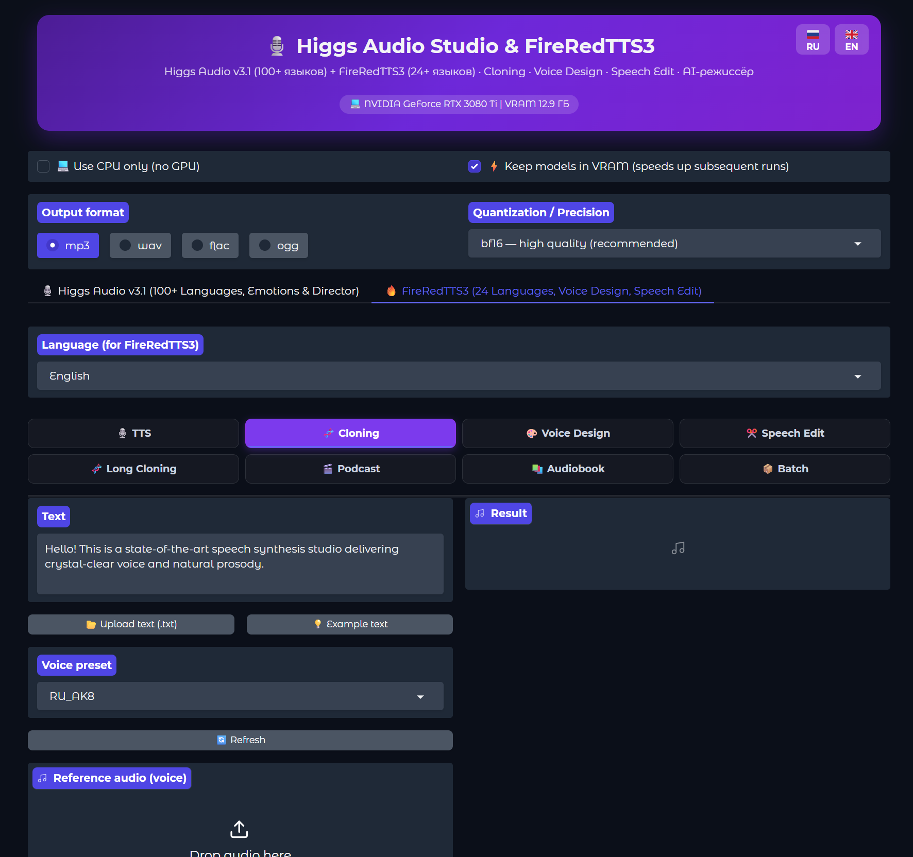

<div align="center">

# 🎙️ Higgs Audio Studio & FireRedTTS3

<!-- super-markdown-toc -->

## Table of Contents

* [Higgs Audio Studio & FireRedTTS3](#higgs-audio-studio--fireredtts3)
  + [Features](#features)
  + [Dual-Engine Architecture](#dual-engine-architecture)
  + [System Requirements](#system-requirements)
    - [Platforms](#platforms)
    - [Memory and Quantization](#memory-and-quantization)
  + [Quick Start](#quick-start)
  + [Fork Additions and Updates](#fork-additions-and-updates)
  + [Authors & Acknowledgments](#authors--acknowledgments)
  + [License](#license)
  + [Support this Project](#support-this-project)
<!-- /super-markdown-toc -->

**Next-generation local speech synthesis and voice cloning studio: uniting the expressive power of Higgs Audio v3.1 and the pristine precision of FireRedTTS3. 100% offline, one-click portable runtime.**

[](#license)
[](https://github.com/SaidAuita/HiggsAudio-Studio/stargazers)
[](https://github.com/SaidAuita/HiggsAudio-Studio/commits/main)

**[English](README.md)** · **[Русский](README_RU.md)**



</div>

---

## Features

* **🎙️ Dual-Engine Architecture** — switch on the fly between **Higgs Audio v3.1** (theatrical emotions, sighs, laughter, 43 inline tags) and **FireRedTTS3** (crystal-clear audio, 10-step DiT Flow Matching, zero hallucinations).
* **🧬 Zero-Shot Voice Cloning** — clone any voice from a short reference audio clip (3–6 seconds) with automatic transcript recognition (Moonshine ASR). Full support for cross-lingual cloning (e.g. Russian reference ➔ English speech).
* **🎨 Voice Design** — generate brand new voices from descriptive natural-language prompts («*A warm, confident male voice in his 30s speaking Russian at a steady pace*»).
* **✂️ Speech Editing** — modify, insert, or delete words in existing audio without re-recording, with fine-grained control over speed, pitch, and volume.
* **🎭 Expressive Speech & AI Director** — insert 43 inline emotion tags (`<|emotion:happy|>`), sound effects (`<|sfx:laughter|>`), prosody, and style controls + auto-enrichment via local LLM or External API (LM Studio, Ollama, OpenAI).
* **🧬 Long Voice Cloning** — voice-over for large books and chapters with sentence chunking, step-by-step synthesis, seamless concatenation, customizable gaps, and auto-increment file numbering (`01.mp3`, `02.mp3`...).
* **🎬 Podcast & Audiobook Studio** — multi-speaker casting, script generation, and role attribution with standard EBU R128 loudness leveling (LUFS −16).
* **📦 Batch Processing** — mass synthesis of multiple text lines with live progress tracking.
* **🔇 Intelligent VAD Tail Cleaning** — `trim_trailing_artifacts` filter completely removes vocoder clicks, trailing diffusion noise, and hallucinations on single words and short phrases.
* **🌐 100% Bilingual Interface (RU 🇷🇺 / EN 🇬🇧)** — real-time client-side language switching without page reloads.
* **💾 Full GUI State Persistence** — automatically saves and restores selected engine, sub-tabs, presets, quantization mode (`bf16`, `8-bit`, `4-bit`, `fp32`), and parameters across app restarts.

---

## Dual-Engine Architecture

| Parameter | 🎙️ Higgs Audio v3.1 | 🔥 FireRedTTS3 |
| :--- | :--- | :--- |
| **Developer** | Boson AI | FireRedTeam / Xiaohongshu |
| **Architecture** | 4B Autoregressive Transformer + Vocoder | Qwen3 1.7B + 10-step DiT Flow Matching + RedAE + CAM++ |
| **Quantization** | `bf16`, `8-bit (INT8)`, `4-bit (NF4)`, `fp32` | `bf16`, `8-bit (INT8)`, `fp32` |
| **Languages** | 100+ languages (expressive focus) | 24 languages (Russian, English, German, French, Spanish, Chinese, Japanese, etc.) |
| **Key Strengths** | 43 emotion/SFX tags, theatrical acting, AI Director | Pristine clarity, instant Voice Design, Speech Edit, stability |
| **Modes** | TTS, Expressive, Clone, Long Clone, Podcast, Book, Batch | TTS, Clone, Voice Design, Speech Edit, Long Clone, Podcast, Book, Batch |

---

## System Requirements

### Platforms

| OS | GPU | Status | Acceleration |
|---|---|---|---|
| Windows 10/11 | NVIDIA RTX 30xx–50xx | ✅ tested | CUDA 12.8 / 12.6 + Triton / SDPA |
| Windows 10/11 | NVIDIA RTX 20xx / GTX 16xx | ✅ supported | CUDA 12.6 / 11.8 |
| Windows / Linux | CPU only | ✅ supported | Streaming CPU synthesis |

### Memory and Quantization

| VRAM | TTS Mode | Director / LLM Mode |
|:---|:---|:---|
| **24 GB+** | `bf16` (~11 GB) | 9–12B in 4-bit (~6–8 GB) |
| **12–16 GB** | `bf16` / `8-bit` (~6–8 GB) | 4–9B in 4-bit (~3–6 GB) |
| **6–8 GB** | `8-bit` / `4-bit` (~3.5–6 GB) | 2–4B in 4-bit / External API |
| **CPU** | `💻 Use CPU only` mode | Runs entirely on CPU without GPU |

---

## Quick Start

1. **Clone the repository:**
   ```bash
   git clone https://github.com/SaidAuita/HiggsAudio-Studio.git
   cd HiggsAudio-Studio
   ```

2. **Install:**
   * Run `install.bat` and select your GPU CUDA version (CUDA 12.8, 12.6, 11.8 or CPU).
   * The installer configures a portable Python 3.12 environment with PyTorch and all dependencies.

3. **Launch:**
   * Run `run.bat`.
   * The app opens automatically in your browser at `http://127.0.0.1:7860`.
   * On first launch, model weights will be downloaded automatically into `models/`.

---

## Fork Additions and Updates

* **FireRedTTS3 Integration**:
  * Full support for `FireRedTTS3-bf16`, `FireRedTTS3-fp32`, and `FireRedTTS3-int8`.
  * Integrated **Voice Design** (generating unique voices from text prompts via the Instruct model) and **Speech Edit** (semantic and acoustic audio editing).
  * Automatic cross-lingual cloning using CAM++ speaker embeddings.
* **End-of-Speech VAD Cleaning (`trim_trailing_artifacts`)**:
  * Eliminates vocoder boundary clicks, trailing diffusion noise, and repeating hallucinations on short sentences and single words.
  * Optimized diffusion step calculation, accelerating short-phrase synthesis up to 3.5×.
* **Process Isolation for RTX 30xx/40xx/50xx**:
  * Background daemon `director_daemon.py` isolates CUDA contexts between `llama.cpp` and `PyTorch`, preventing crashes.
* **Long Voice Cloning with Auto-Numbering**:
  * Batch synthesis for audiobook chapters with automatic file numbering (`01`, `02`, `03`...) saved to `output/NUM/`.
* **Full Bilingual Support (RU / EN)**:
  * 100% translation coverage for all UI elements, tabs, dropdowns, examples, and tooltips.

---

## Authors & Acknowledgments

* **timoncool** — author of the original HiggsAudio-Studio project.
* **SaidAuita** — author of this fork, FireRedTTS3 integration, dual-engine architecture, VAD filtering, and localization.
* **Boson AI** — creators of [Higgs Audio v3](https://huggingface.co/bosonai/higgs-audio-v3-tts-4b).
* **FireRedTeam / Xiaohongshu** — creators of [FireRedTTS3](https://github.com/FireRedTeam/FireRedTTS3).
* **UsefulSensors** — [Moonshine ASR](https://github.com/usefulsensors/moonshine) reference transcription.

---

## License

Wrapper code is open-source. Higgs Audio v3 and FireRedTTS3 model weights are provided under Research & Non-Commercial licenses. Voice cloning is allowed strictly with the consent of the voice owner.

---

## Support this Project

If this project is helpful to you and you wish to support its development:
* **USDT (TRC20):** `TBWzmMZWbirvACAtPfoZioAhhwSM4n2ArY`
* **Website:** [Ph-CU-S.com](https://ph-cu-s.com) (Photoshop to ComfyUI Plugin)
 - Grouped custom number controls into a harmonious single-line block matching standard Gradio component height.
  - Removed Gradio component-level progress overlays so input boxes and number controls remain clutter-free.

