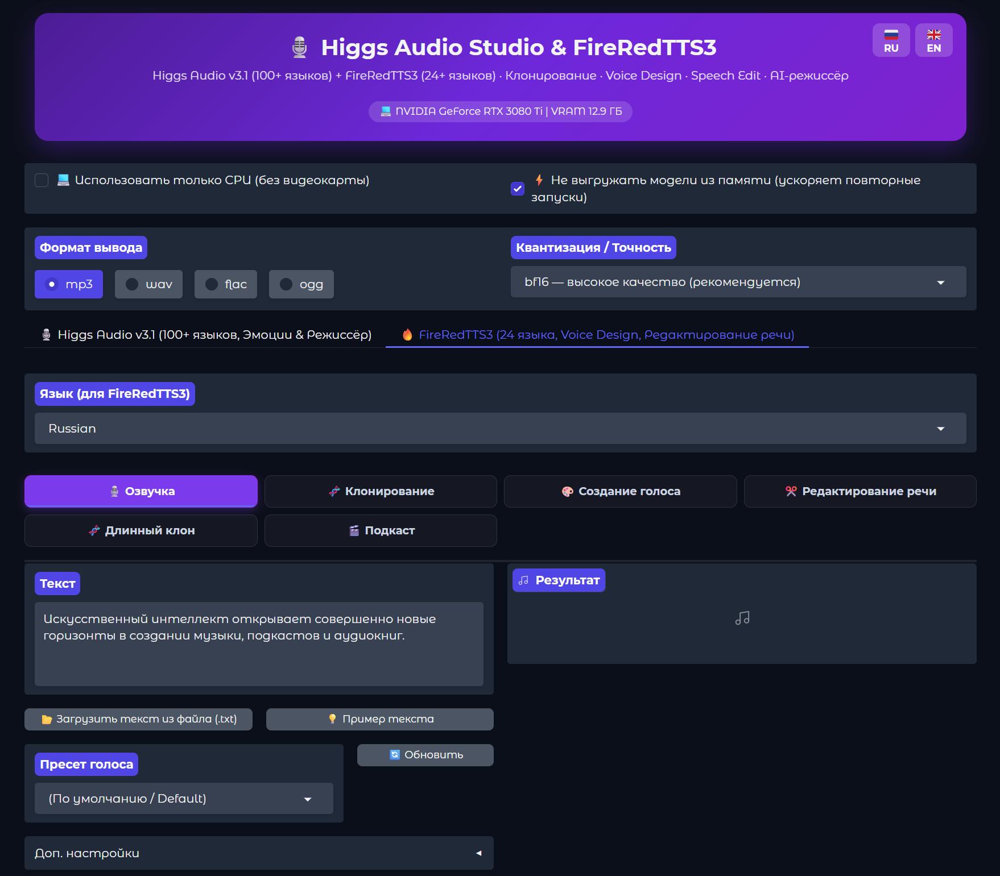

<div align="center">

# 🎙️ Higgs Audio Studio & FireRedTTS3

<!-- super-markdown-toc -->

## Содержание

* [Higgs Audio Studio & FireRedTTS3](#higgs-audio-studio--fireredtts3)
  + [Возможности](#возможности)
  + [Архитектура двух движков](#архитектура-двух-движков)
  + [Системные требования](#системные-требования)
    - [Платформы](#платформы)
    - [Память и квантизация](#память-и-квантизация)
  + [Быстрый старт](#быстрый-старт)
  + [Нововведения и обновления форка](#нововведения-и-обновления-форка)
  + [Авторы и благодарности](#авторы-и-благодарности)
  + [Лицензия](#лицензия)
  + [Поддержка проекта](#поддержка-проекта)
<!-- /super-markdown-toc -->

**Универсальная локальная студия синтеза и клонирования речи нового поколения: объединение экспрессивного движка Higgs Audio v3.1 и сверхчистого гибридного движка FireRedTTS3. 100% оффлайн, запуск в один клик.**

[](#лицензия)
[](https://github.com/SaidAuita/HiggsAudio-Studio/stargazers)
[](https://github.com/SaidAuita/HiggsAudio-Studio/commits/main)

**[English](README.md)** · **[Русский](README_RU.md)**



</div>

---

## Возможности

* **🎙️ Два мощных движка в одном интерфейсе** — мгновенное переключение между **Higgs Audio v3.1** (театральные эмоции, вздохи, смех, 43 тега) и **FireRedTTS3** (кристальная чистота звука, 10-шаговый DiT Flow Matching, отсутствие артефактов).
* **🧬 Клонирование голоса (Zero-Shot)** — клонирование любого голоса по короткому аудио-образцу (3–6 сек) с автоматическим распознаванием текста (Moonshine ASR). Поддержка кросс-языкового клонирования (русский образец ➔ английская речь).
* **🎨 Создание голоса по описанию (Voice Design)** — генерация совершенно новых уникальных тембров по текстовому описанию («*Спокойный, глубокий мужской голос 35 лет с тёплым бархатным тембром*»).
* **✂️ Редактирование речи (Speech Edit)** — замена, вставка или удаление слов в готовом аудио без перезаписи всей дорожки, а также тонкая регулировка скорости, высоты тона и громкости.
* **🎭 Экспрессия и AI-Режиссёр** — инлайн-теги эмоций (`<|emotion:happy|>`), звуков (`<|sfx:laughter|>`), просодии и стилей + автоматическое обогащение текста локальной LLM или внешним API (LM Studio, Ollama, OpenAI).
* **🧬 Длинный клон (Long Voice Cloning)** — озвучка больших текстов и книг с автоматической разбивкой на предложения, пошаговой генерацией, бесшовной склейкой, настраиваемыми паузами и авто-нумерацией файлов (`01.mp3`, `02.mp3`...).
* **🎬 Подкасты и Аудиокниги** — создание многоголосых диалогов и радиоспектаклей с автоматическим выравниванием громкости по стандарту EBU R128 (LUFS −16).
* **📦 Пакетная обработка (Batch)** — параллельная озвучка списков реплик с отображением прогресса в реальном времени.
* **🔇 Интеллектуальный VAD-фильтр хвостов** — алгоритм `trim_trailing_artifacts` исключает щелчки вокодера, шум и диффузионные галлюцинации на коротких фразах и одиночных словах.
* **🌐 100% Двуязычный интерфейс (RU 🇷🇺 / EN 🇬🇧)** — динамическое переключение языка в реальном времени без перезагрузки.
* **💾 Полное автосохранение GUI** — запоминание активного движка, под-вкладок, пресетов, квантизации (`bf16`, `8-bit`, `4-bit`, `fp32`) и параметров генерации между запусками.

---

## Архитектура двух движков

| Параметр | 🎙️ Higgs Audio v3.1 | 🔥 FireRedTTS3 |
| :--- | :--- | :--- |
| **Разработчик** | Boson AI | FireRedTeam / Xiaohongshu |
| **Архитектура** | 4B Autoregressive Transformer + Vocoder | Qwen3 1.7B + 10-step DiT Flow Matching + RedAE + CAM++ |
| **Квантизация** | `bf16`, `8-bit (INT8)`, `4-bit (NF4)`, `fp32` | `bf16`, `8-bit (INT8)`, `fp32` |
| **Языки** | 100+ языков (акцент на экспрессию) | 24 языка (русский, английский, немецкий, французский, китайский, японский и др.) |
| **Главные преимущества** | 43 тега эмоций/SFX, театральная игра, AI-режиссёр | Кристально чистый звук, мгновенный Voice Design, Speech Edit, стабильность |
| **Режимы** | Озвучка, Экспрессия, Клон, Длинный клон, Подкаст, Книга, Пакет | Озвучка, Клон, Создание голоса, Редактирование, Длинный клон, Подкаст, Книга, Пакет |

---

## Системные требования

### Платформы

| ОС | GPU | Статус | Ускорение |
|---|---|---|---|
| Windows 10/11 | NVIDIA RTX 30xx–50xx | ✅ протестировано | CUDA 12.8 / 12.6 + Triton / SDPA |
| Windows 10/11 | NVIDIA RTX 20xx / GTX 16xx | ✅ поддерживается | CUDA 12.6 / 11.8 |
| Windows / Linux | CPU only | ✅ поддерживается | Потоковый синтез на CPU |

### Память и квантизация

| VRAM | Режим TTS | Модель режиссёра / LLM |
|:---|:---|:---|
| **24 ГБ+** | `bf16` (~11 ГБ) | 9–12B в 4-bit (~6–8 ГБ) |
| **12–16 ГБ** | `bf16` / `8-bit` (~6–8 ГБ) | 4–9B в 4-bit (~3–6 ГБ) |
| **6–8 ГБ** | `8-bit` / `4-bit` (~3.5–6 ГБ) | 2–4B в 4-bit / Внешний API |
| **CPU** | Режим `💻 Использовать только CPU` | Работает без видеокарты |

---

## Быстрый старт

1. **Клонируйте репозиторий:**
   ```bash
   git clone https://github.com/SaidAuita/HiggsAudio-Studio.git
   cd HiggsAudio-Studio
   ```

2. **Установка:**
   * Запустите `install.bat` и выберите версию CUDA вашей видеокарты (CUDA 12.8, 12.6, 11.8 или CPU).
   * Скрипт автоматически создаст портативное окружение Python 3.12, установит PyTorch и все зависимости.

3. **Запуск:**
   * Запустите `run.bat`.
   * Интерфейс автоматически откроется в браузере по адресу `http://127.0.0.1:7860`.
   * При первом запуске необходимые модели автоматически загрузятся в папку `models/`.

---

## Нововведения и обновления форка

* **Интеграция FireRedTTS3**:
  * Реализована полная поддержка моделей `FireRedTTS3-bf16`, `FireRedTTS3-fp32` и `FireRedTTS3-int8`.
  * Добавлены панели **Voice Design** (генерация уникальных голосов по тексту через Instruct-модель) и **Speech Edit** (семантическое и акустическое редактирование речи).
  * Настроено автоматическое переключение на CAM++ спикер-эмбеддинги при кросс-языковом клонировании.
* **Устранение концевых артефактов (VAD Tail Clean)**:
  * Внедрён модуль `trim_trailing_artifacts`, устраняющий паразитные хвосты, шум вокодера и щелчки на коротких предложениях и одиночных словах.
  * Оптимизирован динамический расчёт шагов диффузии, ускоривший синтез коротких фраз до 3.5 раз.
* **Изоляция процессов LLM и совместимость с RTX 30xx/40xx/50xx**:
  * Фоновый демон `director_daemon.py` разделяет контексты CUDA между `llama.cpp` и `PyTorch`, исключая сбои памяти.
* **Длинное клонирование с автонумерацией**:
  * Пакетная генерация глав аудиокниг с автоматическим инкрементом номеров файлов (`01`, `02`, `03`...) в папке `output/NUM/`.
* **Полная локализация (RU / EN)**:
  * 100% покрытие перевода для всех элементов управления, вкладок, выпадающих списков, примеров и всплывающих подсказок.

---

## Авторы и благодарности

* **timoncool** — автор оригинального проекта HiggsAudio-Studio.
* **SaidAuita** — автор форка, интеграции FireRedTTS3, архитектуры двух движков, VAD-фильтрации и расширенной локализации.
* **Boson AI** — создатели модели [Higgs Audio v3](https://huggingface.co/bosonai/higgs-audio-v3-tts-4b).
* **FireRedTeam / Xiaohongshu** — создатели модели [FireRedTTS3](https://github.com/FireRedTeam/FireRedTTS3).
* **UsefulSensors** — модель распознавания речи [Moonshine ASR](https://github.com/usefulsensors/moonshine).

---

## Лицензия

Код оболочки распространяется под открытой лицензией. Веса моделей Higgs Audio v3 и FireRedTTS3 предоставляются их авторами для исследовательских и некоммерческих целей. Клонирование голоса разрешено только с согласия правообладателя голоса.

---

## Поддержка проекта

Если проект оказался для вас полезным:
* **USDT (TRC20):** `TBWzmMZWbirvACAtPfoZioAhhwSM4n2ArY`
* **Website:** [Ph-CU-S.com](https://ph-cu-s.com) (Photoshop to ComfyUI Plugin)


